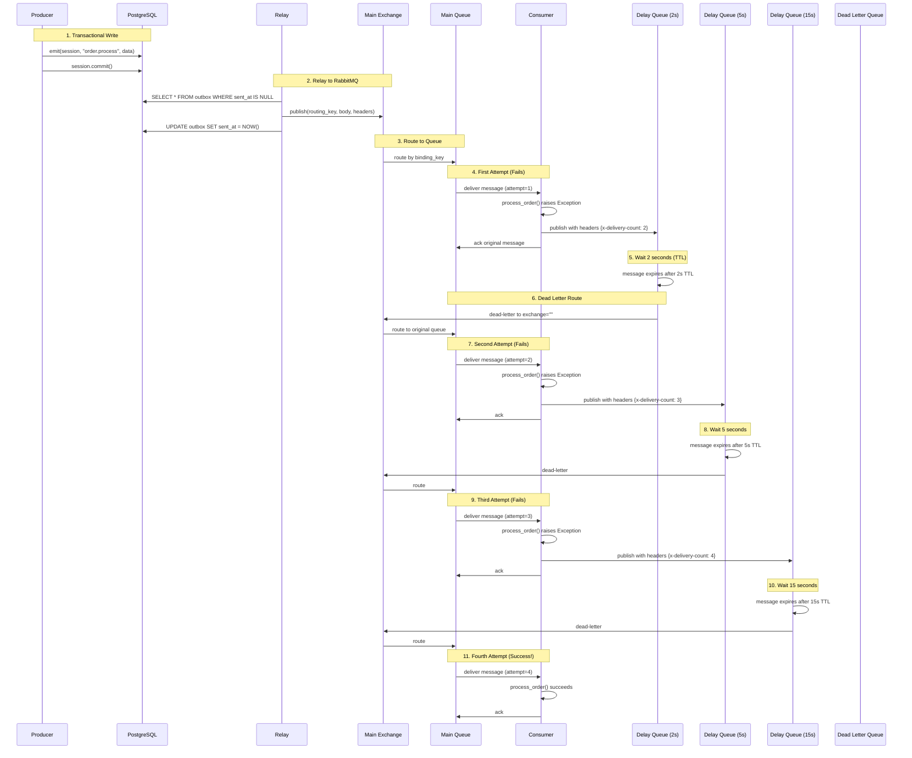

# Architecture: Delayed Retries with Exponential Backoff

## Overview

This document explains how the delayed retry mechanism works under the hood.

## Message Flow Diagram



## Component Details

### 1. Delay Queues

Each listener with `retry_delays=(2, 5, 15)` gets three delay queues:

```
demo.order_processor              # Main queue
demo.order_processor.delay_2s     # 2-second delay
demo.order_processor.delay_5s     # 5-second delay
demo.order_processor.delay_15s    # 15-second delay
demo.order_processor.dlq          # Dead letter queue
```

**Delay Queue Configuration:**
```python
{
    "x-message-ttl": 2000,  # milliseconds
    "x-dead-letter-exchange": "",  # default exchange
    "x-dead-letter-routing-key": "demo.order_processor",  # back to main
    "x-queue-type": "quorum"
}
```

### 2. Retry Logic in Consumer

When a message fails, the consumer:

1. Checks attempt count from `x-delivery-count` header
2. Determines if retries are exhausted (`attempt > len(retry_delays) + 1`)
3. If retries remain:
   - Calculates which delay to use: `retry_delays[attempt - 1]`
   - Publishes to appropriate delay queue
   - Increments delivery count: `x-delivery-count = attempt + 1`
   - Preserves original routing key: `x-original-routing-key`
   - Acks the original message
4. If retries exhausted:
   - Nacks with `requeue=False` (sends to DLQ)

**Code snippet from `__init__.py`:**
```python
async def _delayed_retry(self, message, attempt_count, ...):
    retry_delays = self.retry_delays or ()

    if attempt_count > len(retry_delays):
        await message.nack(requeue=False)  # → DLQ
        return

    delay = retry_delays[attempt_count - 1]
    delay_queue_name = f"{self.queue}.delay_{delay}s"

    new_headers = dict(message.headers) if message.headers else {}
    new_headers["x-delivery-count"] = str(attempt_count + 1)
    new_headers["x-original-routing-key"] = routing_key

    await self._default_exchange.publish(
        aio_pika.Message(body=message.body, headers=new_headers),
        routing_key=delay_queue_name
    )

    await message.ack()
```

### 3. TTL Expiration and Dead-Lettering

When a message sits in a delay queue:

1. **TTL Countdown**: RabbitMQ automatically counts down the TTL
2. **Expiration**: After TTL expires, message becomes "dead"
3. **Dead Letter Routing**:
   - Uses `x-dead-letter-exchange` (default exchange "")
   - Uses `x-dead-letter-routing-key` (original queue name)
   - Default exchange routes by exact queue name match
4. **Message Returns**: Message appears in main queue as a new delivery

### 4. Header Tracking

Headers used for retry tracking:

| Header | Purpose | Example |
|--------|---------|---------|
| `x-delivery-count` | Track retry attempts | `"2"`, `"3"`, `"4"` |
| `x-original-routing-key` | Preserve original routing key | `"order.process"` |
| `x-outbox-tracking-ids` | Distributed tracing | `["uuid1", "uuid2"]` |

### 5. Retry Attempt Calculation

With `retry_delays=(2, 5, 15)`:

| Attempt | Delay Before | Header Count | In Delay Queue | Total Elapsed Time |
|---------|--------------|--------------|----------------|-------------------|
| 1 (initial) | 0s | - | No | 0s |
| 2 (1st retry) | 2s | `"2"` | Yes (2s) | 2s |
| 3 (2nd retry) | 5s | `"3"` | Yes (5s) | 7s |
| 4 (3rd retry) | 15s | `"4"` | Yes (15s) | 22s |
| 5+ | - | - | → DLQ | - |

**Total possible attempts**: `len(retry_delays) + 1 = 4`

### 6. Special Cases

#### Empty retry_delays `()`

```python
@listen("task", retry_delays=())
async def handler(data):
    raise Exception("This goes straight to DLQ")
```

- No delay queues created
- Uses `nack(requeue=False)` on failure
- No retries - failures send message to DLQ
- Useful when manual intervention is required for failures

#### Permanent Rejection with `Reject` Exception

```python
from outbox import Reject

@listen("task", retry_delays=(2, 5))
async def handler(data):
    raise Reject()  # No retries, straight to DLQ
```

- Uses `nack(requeue=False)`
- Skips all retry logic
- Immediate dead-lettering

## Performance Considerations

### Memory Usage

- **Delay queues**: Minimal - only configuration metadata
- **Messages in delay queues**: Standard RabbitMQ message storage
- **Headers**: Small overhead (~100 bytes per message)

### Throughput

- **Delay queue creation**: One-time cost during setup
- **Message publishing**: Extra publish operation per retry (~1ms)
- **TTL checking**: RabbitMQ handles efficiently (passive)

### Scaling

- **Horizontal**: Multiple consumers can process from same queue
- **Vertical**: Delay queues are independent, no contention
- **Load**: Failed messages don't block processing of new messages

## Observability

### RabbitMQ Management UI

Monitor:
- Queue depths (main queue vs delay queues)
- Message rates (publishes/deliveries)
- Consumer acknowledgements
- Dead letter queue accumulation

### Application Logs

The library logs:
- INFO: Successful processing, retries with delay info
- WARNING: Retry attempts, exceeded limits, sending to DLQ
- ERROR: Deserialization failures, unexpected errors

### Metrics to Track

- Retry distribution (how many messages need N retries)
- Average time to success (including retry delays)
- DLQ accumulation rate (permanent failures)
- Per-delay-queue message rates

## Comparison: Old vs New

### Old Behavior (Immediate Retry)

```
[00:00] Attempt 1 → FAIL
[00:00] Attempt 2 → FAIL (immediate)
[00:00] Attempt 3 → FAIL (immediate)
[00:00] Attempt 4 → FAIL (immediate)
[00:00] → DLQ after 4 attempts
```

**Problem**: Thundering herd on transient failures

### New Behavior (Exponential Backoff)

```
[00:00] Attempt 1 → FAIL
[00:02] Attempt 2 → FAIL (after 2s)
[00:07] Attempt 3 → FAIL (after 5s)
[00:22] Attempt 4 → SUCCESS (after 15s)
```

**Benefit**: Graceful handling of transient failures

## Further Reading

- [RabbitMQ TTL Documentation](https://www.rabbitmq.com/ttl.html)
- [Dead Letter Exchanges](https://www.rabbitmq.com/dlx.html)
- [Exponential Backoff](https://en.wikipedia.org/wiki/Exponential_backoff)
- [Quorum Queues](https://www.rabbitmq.com/quorum-queues.html)
